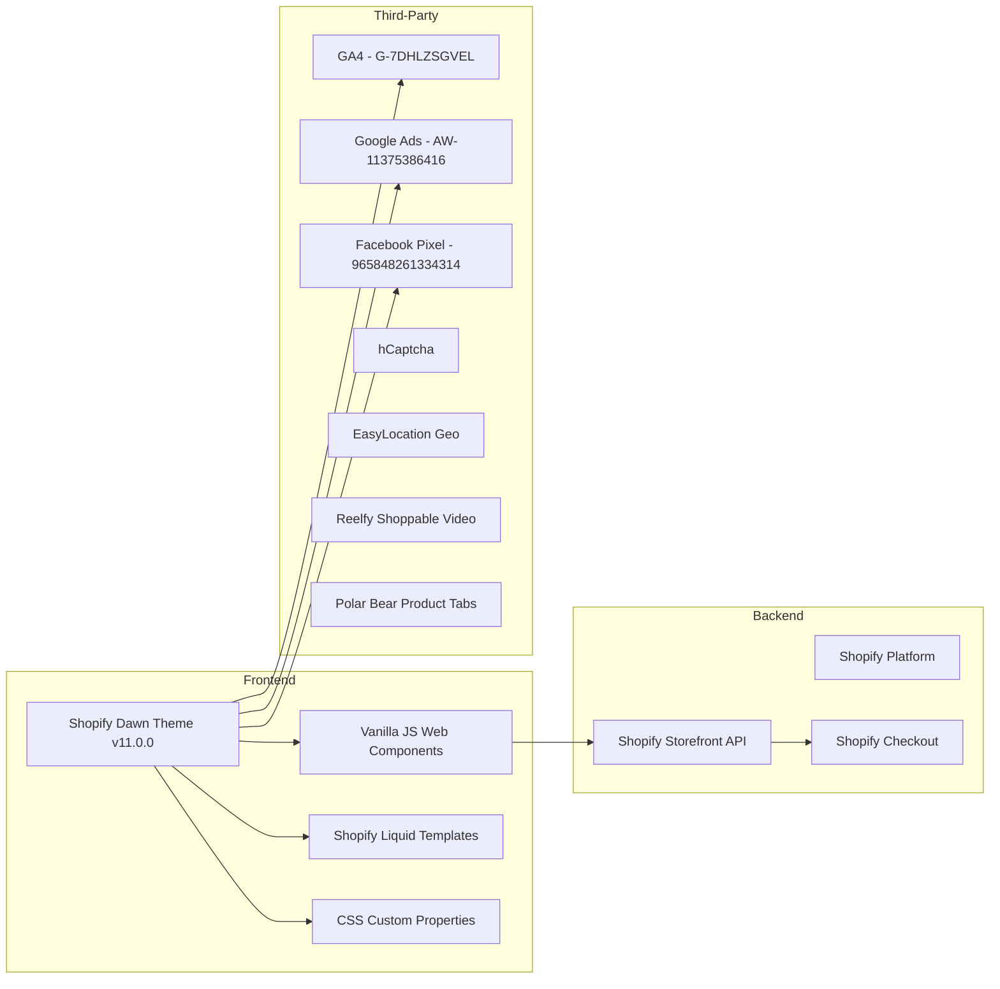
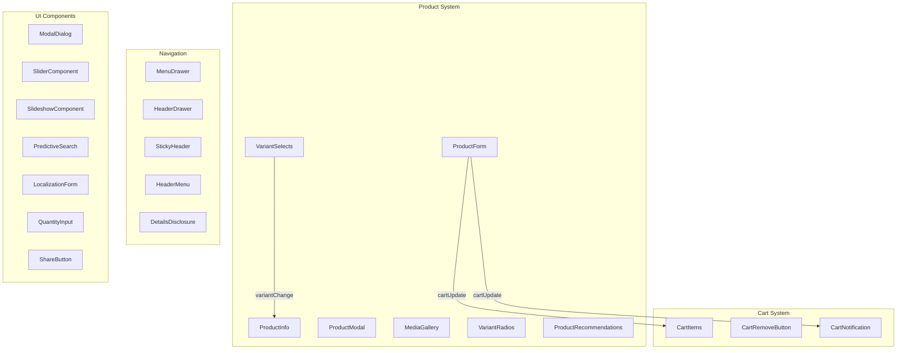

# 01. Аналіз поточного стану сайту muhomornya.com

## 1.1 Загальна інформація

| Параметр | Значення |
|----------|----------|
| **Платформа** | Shopify (Dawn Theme v11.0.0) |
| **Домен** | muhomornya.com |
| **Shopify Shop ID** | 81252942128 |
| **Валюта** | UAH (₴) |
| **Країна за замовч.** | Україна (UA) |
| **Мови** | Українська (uk, default), English (en), Deutsch (de) |
| **Доставка** | 31 країна |

## 1.2 Структура контенту

```mermaid
graph TD
    A[muhomornya.com] --> B[/ - Українська UK default]
    A --> C[/en/ - English]
    A --> D[/de/ - Deutsch]

    B --> B1[/products/ - 32+ товари]
    B --> B2[/collections/ - 7 категорій]
    B --> B3[/pages/ - 7 статичних]
    B --> B4[/blogs/news/ - ~30 статей]
    B --> B5[/blogs/instrukciі-po-vzhivannyu/ - 6 інструкцій]

    C --> C1[/en/products/]
    C --> C2[/en/collections/]
    C --> C3[/en/pages/]
    C --> C4[/en/blogs/news/]
    C --> C5[/en/policies/]

    D --> D1[/de/products/ - суфікс -de]
    D --> D2[/de/collections/ - німецькі slug]
    D --> D3[/de/pages/ - суфікс -de]
    D --> D4[/de/blogs/news-de/]
    D --> D5[/de/policies/]
```

## 1.3 Продуктовий каталог

### Категорії (Collections)

| UK slug | EN slug | DE slug | Назва |
|---------|---------|---------|-------|
| `chervoni-muhomori` | `chervoni-muhomori` | `roter-fliegenpilz-de` | Червоні мухомори |
| `gribu` | `gribu` | `pilze-de` | Гриби |
| `mazi` | `mazi` | `rote-fliegenpilzsalbe-de` | Мазі |
| `nastoyanku` | `nastoyanku` | `fliegenpilz-tinkturen-de` | Настоянки |
| `yizhovik-grebinchastij` | `yizhovik-grebinchastij` | `igelstachelbart` | Їжовик гребінчастий |
| `all-products` | `all-products-en` | `all-products-de` | Всі товари |

### Асортимент (ключові товари)

| Продукт | Варіанти | Ціна (UAH) |
|---------|----------|------------|
| Мухомор червоний в капсулах | 60шт / 120шт | 650 / 1250 |
| Цілі капелюшки мухомора | 50г / 100г | 650 / 1300 |
| Мухомор червоний мелений | 50г | 550 |
| Мухомор + їжовик в порошку (курс) | 1 | 1150 |
| Мухомор + їжовик в капсулах (курс) | 1 | 1350 |
| Мухомор + їжовик капсули скло (курс) | 1 | 1550 |
| Їжовик гребінчастий в капсулах | Варіанти | 550+ |
| Гриб веселка в капсулах | 60шт | 550 |
| Кордіцепс військовий в капсулах | Варіанти | — |
| Гриб чага | 100г | 300 |
| Настоянка мухомора | 100мл | 200 |
| Настоянка гриб веселка | Варіанти | — |
| Мазь з червоного мухомора | — | — |
| Мазь з пантерного мухомора | — | — |
| Чай трав'яний | 50г | 150 |
| Ексклюзивний худі | L/XL/XXL | — |
| Мило ручної роботи | — | — |
| Ювелірні ваги | — | 230 |

## 1.4 Технологічний стек поточного сайту



## 1.5 SEO-інвентаризація

### Meta-теги (на кожній сторінці)

```html
<!-- Google Site Verification (3 коди) -->
<meta name="google-site-verification" content="a65ZPz63ul8ZnzWDuw41wX3hSrdmRuH_UdUI86od9kg" />
<meta name="google-site-verification" content="ssiEuIWL6wIaalWEzCHxqeKRLnpU0ahTxJsrqvmDlgE" />
<meta name="google-site-verification" content="eN2QH9P6dqph6glIB5d_ZG_pdi0tb9nwXPTOP1G0DDs">

<!-- Facebook Domain Verification -->
<meta name="facebook-domain-verification" content="jgmcieakjqdstk6gsulph7s8byskoj">
```

### Canonical URLs

```
UK:  https://muhomornya.com/products/{slug}
EN:  https://muhomornya.com/en/products/{slug}
DE:  https://muhomornya.com/de/products/{slug}
```

### Hreflang (на КОЖНІЙ сторінці)

```html
<link rel="alternate" hreflang="x-default" href="{uk-url}">
<link rel="alternate" hreflang="uk" href="{uk-url}">
<link rel="alternate" hreflang="en" href="{en-url}">
<link rel="alternate" hreflang="de" href="{de-url}">
```

### JSON-LD Structured Data

**Organization (глобально):**
```json
{
  "@context": "http://schema.org",
  "@type": "Organization",
  "name": "Крамниця Мухоморня",
  "logo": "https://muhomornya.com/cdn/shop/files/muhomornya-logotype_*.png",
  "sameAs": ["https://instagram.com/zazemlena.in.ua"],
  "url": "https://muhomornya.com"
}
```

**Product (на сторінках товарів):**
```json
{
  "@context": "http://schema.org/",
  "@type": "Product",
  "name": "...",
  "url": "...",
  "image": ["..."],
  "brand": { "@type": "Brand", "name": "Крамниця Мухоморня" },
  "offers": [
    {
      "@type": "Offer",
      "availability": "http://schema.org/InStock",
      "price": 650.0,
      "priceCurrency": "UAH",
      "url": "...?variant=..."
    }
  ]
}
```

### Open Graph

```html
<meta property="og:site_name" content="Крамниця Мухоморня">
<meta property="og:type" content="product"> <!-- або "website" -->
<meta property="og:price:amount" content="650.00">
<meta property="og:price:currency" content="UAH">
<meta property="og:image" content="...">
<meta property="og:image:width" content="1200">
<meta property="og:image:height" content="628">
```

### Twitter Cards

```html
<meta name="twitter:card" content="summary_large_image">
```

### Feeds

- Atom: `/blogs/news.atom`, `/collections/{slug}.atom`
- oEmbed: `/products/{slug}.oembed`, `/collections/{slug}.oembed`
- Sitemap: `https://muhomornya.com/sitemap.xml`

### robots.txt (ключові правила)

```
Sitemap: https://muhomornya.com/sitemap.xml
Disallow: /admin /cart /orders /checkouts/ /checkout
Disallow: /carts /account /search /policies/ /*/policies/
User-agent: AhrefsBot → Crawl-delay: 10
User-agent: MJ12bot → Crawl-delay: 10
```

## 1.6 Дизайн-система

### Шрифти

| Шрифт | Використання | Вага |
|-------|-------------|------|
| **Assistant** | Body text | 400 (regular), 700 (bold) |
| **Montserrat** | Headings | 600 (semi-bold) |

### Кольорова палітра бренду

```
Brand Red (primary):  #7D0015  rgb(125, 0, 21)
Crimson (accent):     #BA1934  rgb(186, 25, 52)
Tan/Gold (warm):      #D4B59D  rgb(212, 181, 157)
Peach:                #ECD6C6  rgb(236, 214, 198)
Black:                #000000
Near-black:           #121212
White:                #FFFFFF
Light gray:           #F3F3F3
Dark blue-gray:       #242833  rgb(36, 40, 51)
```

### Breakpoints

| Назва | Значення |
|-------|----------|
| Mobile | max-width: 749px |
| Tablet | 750px — 989px |
| Desktop | min-width: 990px |

### Layout tokens

```css
--page-width: 140rem;            /* 1400px */
--buttons-radius: 0px;           /* Квадратні кнопки */
--variant-pills-radius: 40px;    /* Округлі pill */
--inputs-radius: 0px;
--media-radius: 0px;
```

## 1.7 Аналітика та трекінг

| Сервіс | ID |
|--------|----|
| GA4 | G-7DHLZSGVEL |
| Google Ads | AW-11375386416 |
| Google Merchant Center | MC-QBL51G1WLR |
| Facebook Pixel | 965848261334314 |
| Facebook CAPI | Enabled (server-side) |
| hCaptcha | f06e6c50-85a8-45c8-87d0-21a2b65856fe |

### GA4 Events (що відстежуються)

- `page_view`, `view_item`, `add_to_cart`
- `add_payment_info`, `begin_checkout`, `purchase`
- `search`

## 1.8 Web Components (22 компоненти для міграції)


