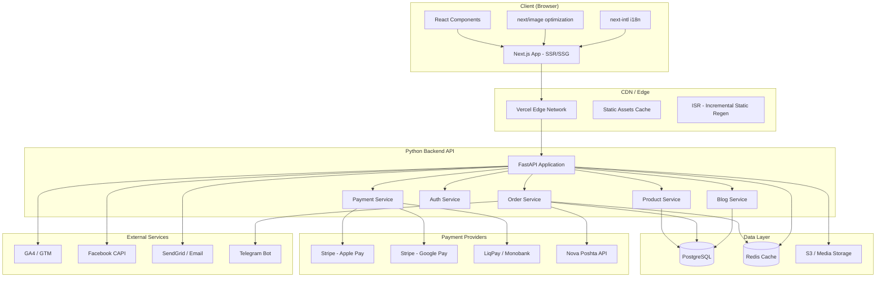
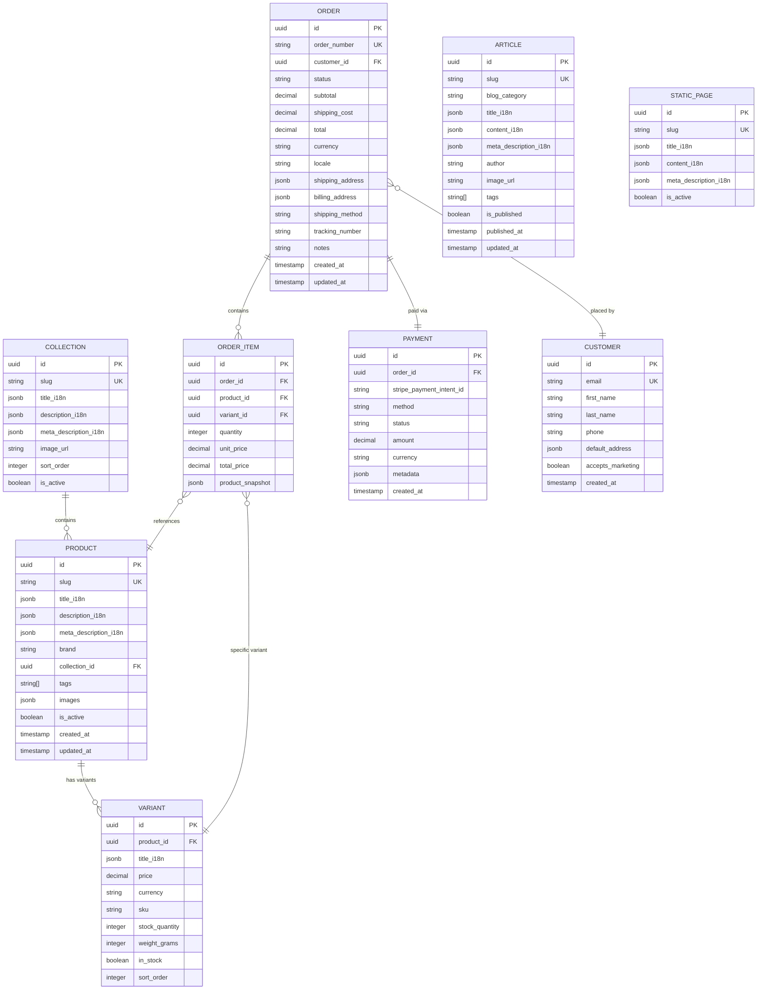

# 02. Архітектура міграції: Next.js + Python

## 2.1 Загальна архітектура



## 2.2 Стек технологій

### Frontend (Next.js)

| Технологія | Обґрунтування |
|-----------|---------------|
| **Next.js 15 (App Router)** | SSR + SSG + ISR для SEO; React Server Components |
| **React 19** | UI-компоненти, Server Components |
| **TypeScript** | Type safety |
| **Tailwind CSS v4** | Утиліти + кастомна тема (збереження дизайну) |
| **next-intl** | i18n з підтримкою UK/EN/DE routing |
| **next/image** | Оптимізація зображень (замість Shopify CDN) |
| **next/font** | Локальне завантаження Assistant + Montserrat |
| **Zustand** | Client-side state (cart, UI) |
| **React Hook Form + Zod** | Форми + валідація |

### Backend (Python)

| Технологія | Обґрунтування |
|-----------|---------------|
| **FastAPI** | Async API, автогенерація OpenAPI spec |
| **SQLAlchemy 2.0** | ORM з async support |
| **Alembic** | Database migrations |
| **PostgreSQL 16** | Primary database |
| **Redis** | Caching, sessions, rate limiting |
| **Pydantic v2** | Data validation, settings |
| **Celery + Redis** | Background tasks (email, notifications) |
| **Stripe SDK** | Apple Pay, Google Pay, card payments |
| **boto3** | S3 media storage |

### Infrastructure

| Технологія | Обґрунтування |
|-----------|---------------|
| **Vercel** | Next.js hosting + Edge CDN |
| **Railway / Render** | Python backend hosting |
| **Neon / Supabase** | Managed PostgreSQL |
| **Upstash** | Managed Redis |
| **Cloudflare R2** | Media storage (S3-compatible) |
| **GitHub Actions** | CI/CD pipeline |

## 2.3 Структура Next.js проекту

```
muhomornya-web/
├── src/
│   ├── app/
│   │   ├── [locale]/
│   │   │   ├── layout.tsx              # Root layout з meta, fonts, analytics
│   │   │   ├── page.tsx                # Головна сторінка
│   │   │   ├── products/
│   │   │   │   ├── [slug]/
│   │   │   │   │   └── page.tsx        # Сторінка товару (SSG + ISR)
│   │   │   │   └── page.tsx            # Каталог
│   │   │   ├── collections/
│   │   │   │   └── [slug]/
│   │   │   │       └── page.tsx        # Сторінка категорії
│   │   │   ├── blogs/
│   │   │   │   ├── [category]/
│   │   │   │   │   ├── [slug]/
│   │   │   │   │   │   └── page.tsx    # Стаття блогу
│   │   │   │   │   └── page.tsx        # Список статей
│   │   │   │   └── page.tsx            # Блог index
│   │   │   ├── pages/
│   │   │   │   └── [slug]/
│   │   │   │       └── page.tsx        # Статичні сторінки (FAQ, About...)
│   │   │   ├── cart/
│   │   │   │   └── page.tsx            # Кошик
│   │   │   ├── checkout/
│   │   │   │   └── page.tsx            # Оформлення замовлення
│   │   │   └── policies/
│   │   │       └── [slug]/
│   │   │           └── page.tsx        # Політики (noindex)
│   │   ├── api/
│   │   │   ├── revalidate/
│   │   │   │   └── route.ts            # ISR revalidation webhook
│   │   │   └── og/
│   │   │       └── route.tsx           # Dynamic OG images
│   │   ├── sitemap.ts                  # Dynamic sitemap generation
│   │   ├── robots.ts                   # Dynamic robots.txt
│   │   └── feed/
│   │       └── [type]/
│   │           └── route.ts            # Atom feeds
│   ├── components/
│   │   ├── layout/
│   │   │   ├── Header.tsx
│   │   │   ├── Footer.tsx
│   │   │   ├── AnnouncementBar.tsx
│   │   │   ├── MobileMenu.tsx
│   │   │   └── StickyHeader.tsx
│   │   ├── product/
│   │   │   ├── ProductCard.tsx
│   │   │   ├── ProductGallery.tsx
│   │   │   ├── ProductForm.tsx
│   │   │   ├── VariantSelector.tsx
│   │   │   ├── PriceDisplay.tsx
│   │   │   └── ProductRecommendations.tsx
│   │   ├── cart/
│   │   │   ├── CartDrawer.tsx
│   │   │   ├── CartItem.tsx
│   │   │   └── CartSummary.tsx
│   │   ├── checkout/
│   │   │   ├── CheckoutForm.tsx
│   │   │   ├── PaymentMethods.tsx
│   │   │   ├── ApplePayButton.tsx
│   │   │   └── GooglePayButton.tsx
│   │   ├── collection/
│   │   │   ├── CollectionGrid.tsx
│   │   │   └── CollectionFilters.tsx
│   │   ├── blog/
│   │   │   ├── ArticleCard.tsx
│   │   │   └── ArticleContent.tsx
│   │   ├── ui/
│   │   │   ├── Slider.tsx
│   │   │   ├── Slideshow.tsx
│   │   │   ├── Modal.tsx
│   │   │   ├── Accordion.tsx
│   │   │   ├── SearchBar.tsx
│   │   │   ├── ShareButton.tsx
│   │   │   └── QuantityInput.tsx
│   │   └── seo/
│   │       ├── JsonLd.tsx
│   │       ├── OpenGraph.tsx
│   │       └── HreflangTags.tsx
│   ├── lib/
│   │   ├── api.ts                      # Backend API client
│   │   ├── stripe.ts                   # Stripe client config
│   │   └── analytics.ts               # GA4 + FB tracking
│   ├── store/
│   │   ├── cart.ts                     # Zustand cart store
│   │   └── ui.ts                       # UI state (modals, menu)
│   ├── i18n/
│   │   ├── config.ts
│   │   ├── request.ts
│   │   └── messages/
│   │       ├── uk.json
│   │       ├── en.json
│   │       └── de.json
│   └── styles/
│       └── globals.css                 # Tailwind + custom brand tokens
├── public/
│   ├── fonts/                          # Assistant, Montserrat woff2
│   ├── images/                         # Static images, logos
│   └── favicons/
├── next.config.ts
├── tailwind.config.ts
└── middleware.ts                        # i18n routing, geo-redirect
```

## 2.4 Структура Python Backend

```
muhomornya-api/
├── app/
│   ├── main.py                         # FastAPI app entry
│   ├── config.py                       # Pydantic Settings
│   ├── database.py                     # SQLAlchemy async engine
│   ├── models/
│   │   ├── product.py                  # Product, Variant, Collection
│   │   ├── order.py                    # Order, OrderItem, OrderStatus
│   │   ├── customer.py                 # Customer info
│   │   ├── blog.py                     # Article, BlogCategory
│   │   ├── page.py                     # StaticPage
│   │   └── payment.py                  # Payment, PaymentMethod
│   ├── schemas/
│   │   ├── product.py                  # Pydantic response/request schemas
│   │   ├── order.py
│   │   ├── payment.py
│   │   └── blog.py
│   ├── api/
│   │   ├── v1/
│   │   │   ├── products.py             # GET /products, /products/{slug}
│   │   │   ├── collections.py          # GET /collections/{slug}
│   │   │   ├── orders.py               # POST /orders, GET /orders/{id}
│   │   │   ├── payments.py             # POST /payments/create-intent
│   │   │   ├── cart.py                 # Cart operations
│   │   │   ├── blog.py                 # GET /blog/articles
│   │   │   ├── pages.py               # GET /pages/{slug}
│   │   │   ├── search.py              # GET /search/suggest
│   │   │   └── webhooks.py            # Stripe webhooks, revalidation
│   │   └── deps.py                     # Dependencies (DB session, auth)
│   ├── services/
│   │   ├── product_service.py
│   │   ├── order_service.py
│   │   ├── payment_service.py          # Stripe integration
│   │   ├── shipping_service.py         # Nova Poshta API
│   │   ├── email_service.py
│   │   └── analytics_service.py        # FB CAPI server-side
│   ├── tasks/
│   │   ├── celery_app.py
│   │   ├── email_tasks.py
│   │   └── notification_tasks.py       # Telegram notifications
│   └── migrations/
│       └── versions/
├── tests/
├── alembic.ini
├── pyproject.toml
└── Dockerfile
```

## 2.5 Database Schema (ER-діаграма)



## 2.6 API Endpoints

### Products API

```
GET    /api/v1/products                     # Список товарів (з пагінацією)
GET    /api/v1/products/{slug}              # Товар за slug
GET    /api/v1/products/{slug}/oembed       # oEmbed дані
GET    /api/v1/products/{slug}/recommendations  # Рекомендації
```

### Collections API

```
GET    /api/v1/collections                  # Список категорій
GET    /api/v1/collections/{slug}           # Категорія з товарами
GET    /api/v1/collections/{slug}/oembed    # oEmbed
GET    /api/v1/collections/{slug}/feed.atom # Atom feed
```

### Cart & Orders API

```
POST   /api/v1/cart/add                     # Додати в кошик
PATCH  /api/v1/cart/update                  # Оновити кількість
DELETE /api/v1/cart/remove/{item_id}        # Видалити з кошика
GET    /api/v1/cart                         # Отримати кошик

POST   /api/v1/orders                       # Створити замовлення
GET    /api/v1/orders/{id}                  # Статус замовлення
GET    /api/v1/orders/{id}/tracking         # Трекінг доставки
```

### Payments API

```
POST   /api/v1/payments/create-intent       # Stripe PaymentIntent
POST   /api/v1/payments/confirm             # Підтвердження платежу
POST   /api/v1/webhooks/stripe              # Stripe webhook
```

### Content API

```
GET    /api/v1/blog/{category}              # Статті блогу
GET    /api/v1/blog/{category}/{slug}       # Стаття
GET    /api/v1/blog/{category}/feed.atom    # Atom feed
GET    /api/v1/pages/{slug}                 # Статична сторінка
GET    /api/v1/search/suggest?q=            # Пошук
```
