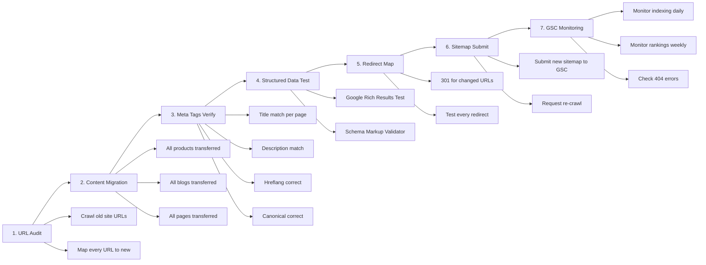

# 03. Стратегія збереження SEO при міграції

## 3.1 Критичний чеклист SEO

```mermaid
graph TD
    A[SEO Preservation] --> B[URL Structure]
    A --> C[Meta Tags]
    A --> D[Structured Data]
    A --> E[Technical SEO]
    A --> F[Content]

    B --> B1[Canonical URLs - exact match]
    B --> B2[301 Redirects map]
    B --> B3[Hreflang cross-links]
    B --> B4[Product slug consistency]

    C --> C1[Title tags per page/locale]
    C --> C2[Meta descriptions per page/locale]
    C --> C3[Open Graph full set]
    C --> C4[Twitter Cards]
    C --> C5[Google/FB verification]

    D --> D1[JSON-LD Organization]
    D --> D2[JSON-LD Product + Offers]
    D --> D3[JSON-LD Article for blog]
    D --> D4[JSON-LD BreadcrumbList]

    E --> E1[robots.txt exact rules]
    E --> E2[sitemap.xml dynamic]
    E --> E3[Atom feeds]
    E --> E4[oEmbed endpoints]
    E --> E5[Core Web Vitals]

    F --> F1[All content migrated]
    F --> F2[Image alt tags]
    F --> F3[Internal link structure]
    F --> F4[Pagination rel=next/prev]
```



## 3.2 URL-маппінг (Shopify → Next.js)

### Обов'язково: ідентичні URL paths

| Тип сторінки | Shopify URL | Next.js URL | Примітка |
|-------------|-------------|-------------|----------|
| Головна UK | `/` | `/` | ✅ Ідентично |
| Головна EN | `/en` | `/en` | ✅ Ідентично |
| Головна DE | `/de` | `/de` | ✅ Ідентично |
| Товар UK | `/products/{slug}` | `/products/{slug}` | ✅ Ідентично |
| Товар EN | `/en/products/{slug}` | `/en/products/{slug}` | ✅ Ідентично |
| Товар DE | `/de/products/{slug-de}` | `/de/products/{slug-de}` | ✅ Ідентично |
| Категорія UK | `/collections/{slug}` | `/collections/{slug}` | ✅ Ідентично |
| Блог UK | `/blogs/news` | `/blogs/news` | ✅ Ідентично |
| Стаття UK | `/blogs/news/{slug}` | `/blogs/news/{slug}` | ✅ Ідентично |
| Стаття DE | `/de/blogs/news-de/{slug-de}` | `/de/blogs/news-de/{slug-de}` | ✅ Ідентично |
| Сторінка | `/pages/{slug}` | `/pages/{slug}` | ✅ Ідентично |
| Сторінка DE | `/de/pages/{slug-de}` | `/de/pages/{slug-de}` | ✅ Ідентично |
| Кошик | `/cart` | `/cart` | ✅ Ідентично |
| Checkout | `/checkouts/*` | `/checkout` | ⚠️ 301 redirect |
| Пошук | `/search` | `/search` | ✅ Ідентично |

### 301 Redirects (обов'язково налаштувати)

```typescript
// next.config.ts
const redirects = async () => [
  // Shopify checkout → наш checkout
  {
    source: '/checkouts/:path*',
    destination: '/checkout',
    permanent: true,
  },
  // Shopify account URLs
  {
    source: '/account/:path*',
    destination: '/',
    permanent: true,
  },
];
```

## 3.3 Реалізація Meta Tags у Next.js

### Шаблон metadata для товару (App Router)

```typescript
// src/app/[locale]/products/[slug]/page.tsx
import { Metadata } from 'next';

export async function generateMetadata({ params }): Promise<Metadata> {
  const { locale, slug } = params;
  const product = await getProduct(slug, locale);

  return {
    title: product.meta_title,
    description: product.meta_description,
    alternates: {
      canonical: `https://muhomornya.com/${locale === 'uk' ? '' : locale + '/'}products/${slug}`,
      languages: {
        'x-default': `https://muhomornya.com/products/${product.slug_uk}`,
        'uk': `https://muhomornya.com/products/${product.slug_uk}`,
        'en': `https://muhomornya.com/en/products/${product.slug_en}`,
        'de': `https://muhomornya.com/de/products/${product.slug_de}`,
      },
    },
    openGraph: {
      type: 'product' as any,
      siteName: 'Крамниця Мухоморня',
      title: product.og_title,
      description: product.og_description,
      url: `https://muhomornya.com/${locale === 'uk' ? '' : locale + '/'}products/${slug}`,
      images: [
        {
          url: product.images[0],
          width: 1200,
          height: 628,
        },
      ],
    },
    twitter: {
      card: 'summary_large_image',
      title: product.meta_title,
      description: product.meta_description,
    },
    verification: {
      google: [
        'a65ZPz63ul8ZnzWDuw41wX3hSrdmRuH_UdUI86od9kg',
        'ssiEuIWL6wIaalWEzCHxqeKRLnpU0ahTxJsrqvmDlgE',
        'eN2QH9P6dqph6glIB5d_ZG_pdi0tb9nwXPTOP1G0DDs',
      ],
      other: {
        'facebook-domain-verification': 'jgmcieakjqdstk6gsulph7s8byskoj',
      },
    },
  };
}
```

## 3.4 JSON-LD Structured Data

### Компонент JsonLd

```typescript
// src/components/seo/JsonLd.tsx
export function OrganizationJsonLd() {
  return (
    <script type="application/ld+json" dangerouslySetInnerHTML={{
      __html: JSON.stringify({
        "@context": "http://schema.org",
        "@type": "Organization",
        "name": "Крамниця Мухоморня",
        "logo": "https://muhomornya.com/images/muhomornya-logotype.png",
        "sameAs": ["https://instagram.com/zazemlena.in.ua"],
        "url": "https://muhomornya.com"
      })
    }} />
  );
}

export function ProductJsonLd({ product, variants }) {
  return (
    <script type="application/ld+json" dangerouslySetInnerHTML={{
      __html: JSON.stringify({
        "@context": "http://schema.org/",
        "@type": "Product",
        "name": product.title,
        "url": product.url,
        "image": product.images,
        "description": product.meta_description,
        "brand": {
          "@type": "Brand",
          "name": "Крамниця Мухоморня"
        },
        "offers": variants.map(v => ({
          "@type": "Offer",
          "availability": v.in_stock
            ? "http://schema.org/InStock"
            : "http://schema.org/OutOfStock",
          "price": v.price,
          "priceCurrency": "UAH",
          "url": `${product.url}?variant=${v.id}`
        }))
      })
    }} />
  );
}
```

## 3.5 Dynamic Sitemap

```typescript
// src/app/sitemap.ts
import { MetadataRoute } from 'next';

export default async function sitemap(): Promise<MetadataRoute.Sitemap> {
  const products = await getAllProducts();
  const articles = await getAllArticles();
  const collections = await getAllCollections();
  const pages = await getAllPages();

  const locales = ['', 'en', 'de'];

  const productUrls = products.flatMap(p =>
    locales.map(locale => ({
      url: `https://muhomornya.com/${locale ? locale + '/' : ''}products/${p.slug[locale || 'uk']}`,
      lastModified: p.updated_at,
      changeFrequency: 'weekly' as const,
      priority: 0.8,
    }))
  );

  const articleUrls = articles.flatMap(a =>
    locales.map(locale => ({
      url: `https://muhomornya.com/${locale ? locale + '/' : ''}blogs/${a.category}/${a.slug[locale || 'uk']}`,
      lastModified: a.updated_at,
      changeFrequency: 'monthly' as const,
      priority: 0.6,
    }))
  );

  // ... collections, pages

  return [
    { url: 'https://muhomornya.com/', changeFrequency: 'daily', priority: 1.0 },
    { url: 'https://muhomornya.com/en', changeFrequency: 'daily', priority: 1.0 },
    { url: 'https://muhomornya.com/de', changeFrequency: 'daily', priority: 1.0 },
    ...productUrls,
    ...articleUrls,
  ];
}
```

## 3.6 Dynamic robots.txt

```typescript
// src/app/robots.ts
import { MetadataRoute } from 'next';

export default function robots(): MetadataRoute.Robots {
  return {
    rules: [
      {
        userAgent: '*',
        allow: '/',
        disallow: [
          '/admin', '/cart', '/checkout', '/orders',
          '/account', '/search', '/policies/', '/*/policies/',
        ],
      },
      { userAgent: 'Nutch', disallow: '/' },
      { userAgent: 'AhrefsBot', crawlDelay: 10 },
      { userAgent: 'AhrefsSiteAudit', crawlDelay: 10 },
      { userAgent: 'MJ12bot', crawlDelay: 10 },
      { userAgent: 'Pinterest', crawlDelay: 1 },
    ],
    sitemap: 'https://muhomornya.com/sitemap.xml',
  };
}
```

## 3.7 Atom Feeds

```typescript
// src/app/feed/[type]/route.ts
export async function GET(req, { params }) {
  // Generate Atom XML for blogs and collections
  // Preserve exact same feed structure as Shopify
}
```

## 3.8 oEmbed Endpoints

```typescript
// src/app/[locale]/products/[slug]/oembed/route.ts
export async function GET(req, { params }) {
  const product = await getProduct(params.slug);
  return Response.json({
    product_id: product.slug,
    title: product.title,
    description: product.description_html,
    brand: "Крамниця Мухоморня",
    offers: product.variants.map(v => ({
      title: v.title,
      offer_id: v.id,
      sku: v.sku || "",
      price: v.price,
      currency_code: "UAH",
      in_stock: v.in_stock,
    })),
    thumbnail_url: product.images[0],
    url: product.canonical_url,
    provider: "Крамниця Мухоморня",
    version: "1.0",
    type: "link",
  });
}
```

## 3.9 Чеклист міграції SEO (покрокова верифікація)



### Пріоритети SEO при міграції

1. **КРИТИЧНО (Day 0)**: Canonical URLs ідентичні, hreflang tags, 301 redirects
2. **КРИТИЧНО (Day 0)**: Meta titles/descriptions точна копія
3. **КРИТИЧНО (Day 0)**: robots.txt + sitemap.xml доступні
4. **ВИСОКИЙ (Week 1)**: JSON-LD structured data на всіх продуктах
5. **ВИСОКИЙ (Week 1)**: Open Graph + Twitter Cards
6. **СЕРЕДНІЙ (Week 2)**: oEmbed endpoints
7. **СЕРЕДНІЙ (Week 2)**: Atom feeds
8. **НИЗЬКИЙ (Week 3)**: Google verification meta-tags (можуть бути перенесені через DNS)

## 3.10 Core Web Vitals — покращення при міграції

| Метрика | Shopify (поточна) | Next.js (цільова) | Стратегія |
|---------|-------------------|-------------------|-----------|
| **LCP** | ~2.5-4s (Shopify CDN) | <2.5s | next/image, preload hero image, SSG |
| **FID/INP** | ~100-200ms (22 web components) | <100ms | React hydration, code splitting |
| **CLS** | ~0.1-0.25 | <0.1 | Reserved image dimensions, font-display: swap |
| **TTFB** | ~600ms (Shopify servers) | <200ms | Vercel Edge, SSG/ISR |
