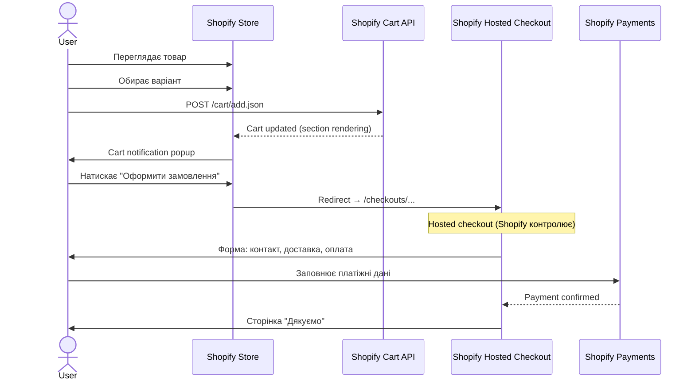
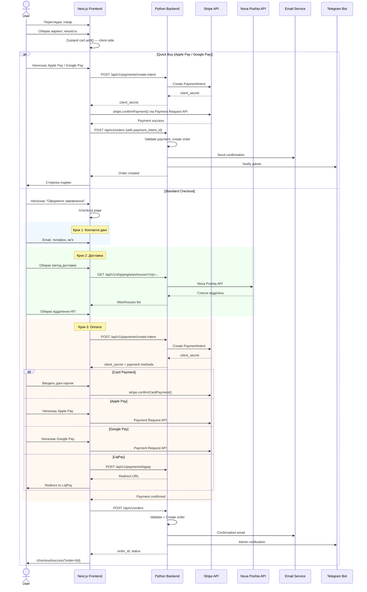
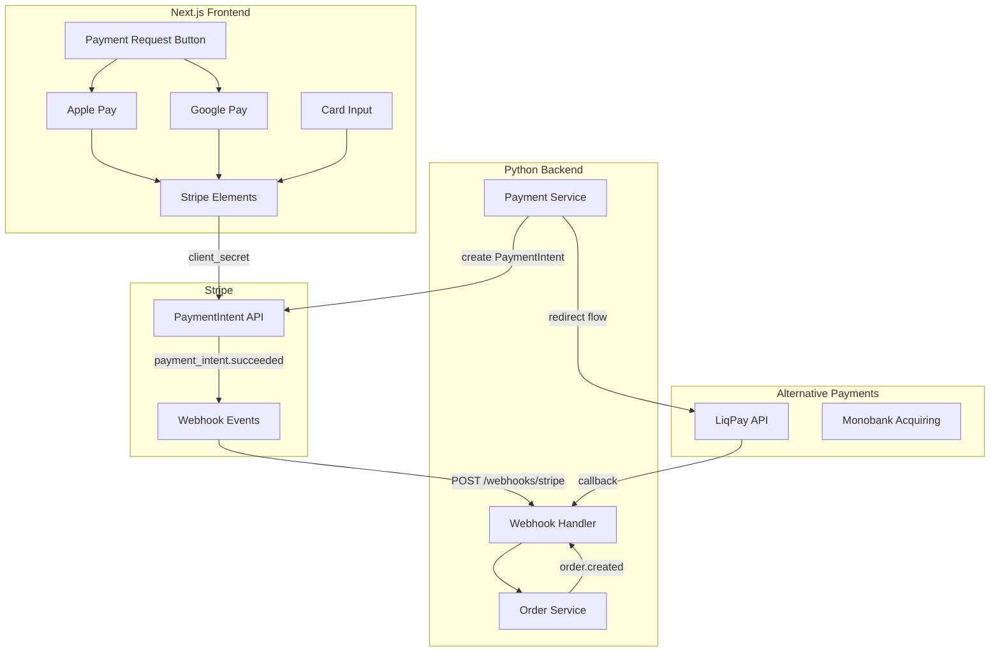
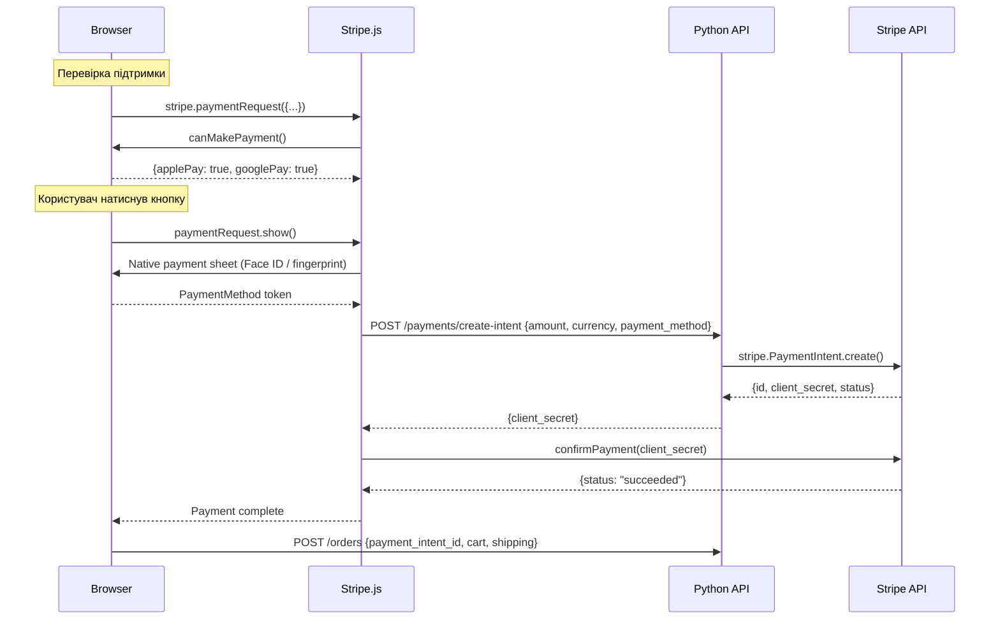
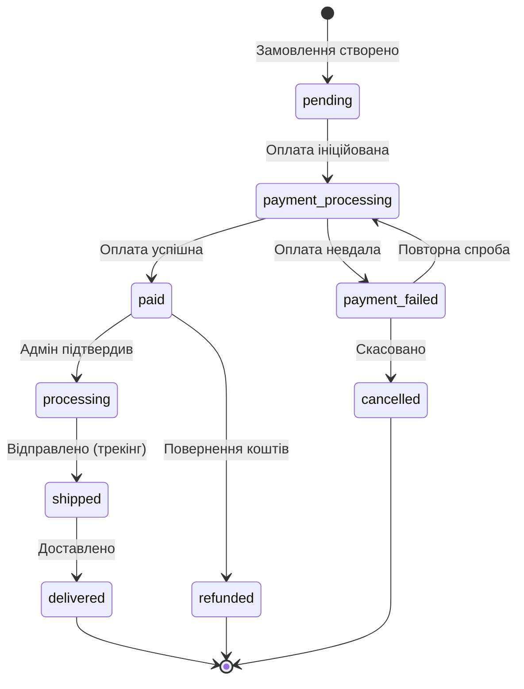
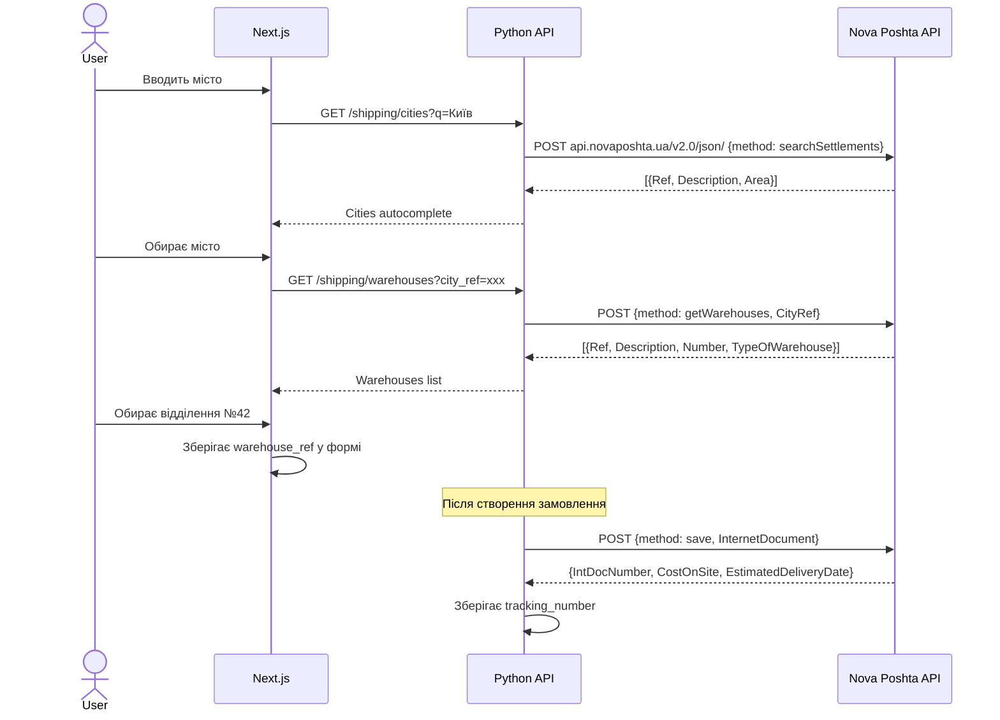
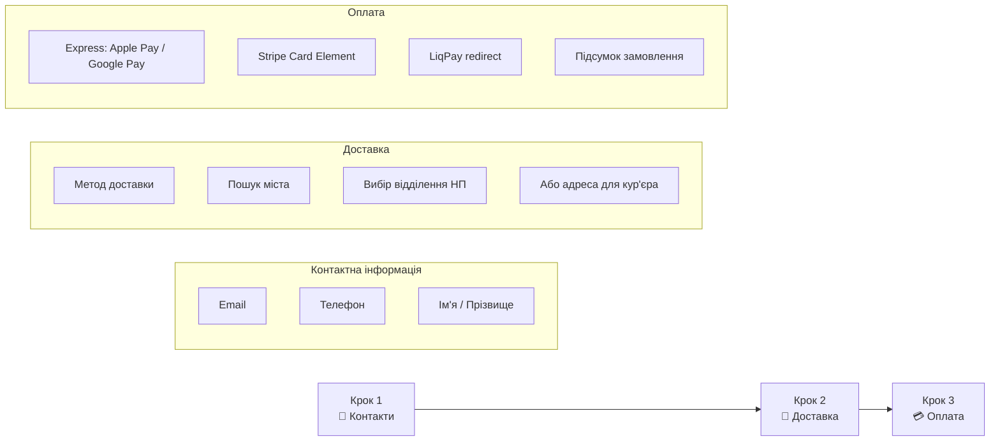
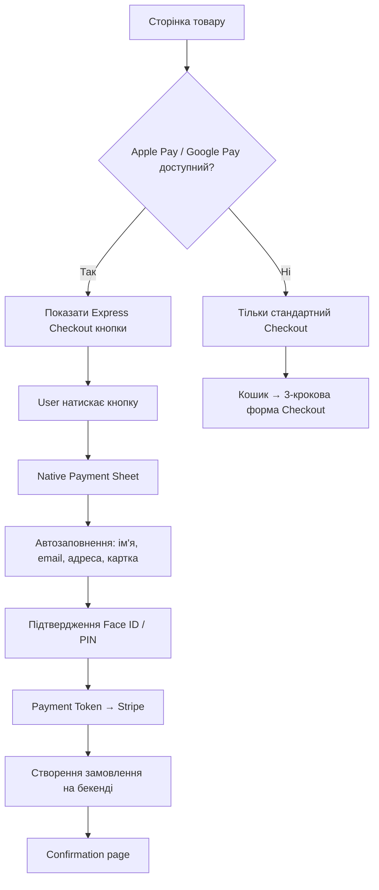
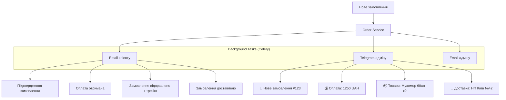

# 04. Удосконалений механізм замовлення + Apple Pay / Google Pay

## 4.1 Поточний флоу замовлення (Shopify)



### Проблеми поточного флоу:
1. ❌ **Hosted checkout** — не кастомізується, різний дизайн
2. ❌ **Redirect** — користувач покидає сайт
3. ❌ **Обмежені способи оплати** — залежність від Shopify Payments
4. ❌ **Немає інтеграції з Nova Poshta API** — ручний ввід адреси
5. ❌ **Немає Apple Pay / Google Pay** як окремих кнопок

## 4.2 Новий флоу замовлення (Next.js + Python + Stripe)



## 4.3 Порівняння поточного vs нового флоу

| Аспект | Shopify (поточний) | Next.js + Stripe (новий) |
|--------|-------------------|--------------------------|
| **Checkout** | Hosted (redirect) | Вбудований (on-site) |
| **Дизайн** | Стандартний Shopify | Кастомний, бренд-консистентний |
| **Apple Pay** | Через Shopify Payments | Stripe Payment Request API |
| **Google Pay** | Через Shopify Payments | Stripe Payment Request API |
| **Карткова оплата** | Shopify Payments | Stripe Elements |
| **LiqPay** | ❌ Не підтримується | ✅ Redirect-based |
| **Monobank** | ❌ Не підтримується | ✅ Можливо через API |
| **Nova Poshta** | Ручний ввід | Автокомплект відділень |
| **Кроки checkout** | 1 сторінка (hosted) | 3 кроки (wizard) |
| **Швидка покупка** | ❌ | ✅ Express checkout buttons |
| **Збереження кошика** | Cookie/session | Zustand + localStorage + server-sync |

## 4.4 Архітектура платежів (Stripe)



## 4.5 Stripe Payment Request API (Apple Pay + Google Pay)

### Як це працює



### Вимоги для Apple Pay

1. **Домен верифікація**: файл `/.well-known/apple-developer-merchantid-domain-association` на сервері
2. **HTTPS обов'язково**: Apple Pay працює тільки через HTTPS
3. **Stripe Dashboard**: активувати Apple Pay в налаштуваннях Stripe
4. **Safari / iOS**: працює тільки в Safari та iOS пристроях

### Вимоги для Google Pay

1. **Google Pay API**: реєстрація merchant ID в Google Pay Business Console
2. **Stripe Dashboard**: активувати Google Pay
3. **Chrome / Android**: працює в Chrome та Android пристроях

## 4.6 Модель даних замовлення



### Структура замовлення

```python
class OrderCreate(BaseModel):
    """Створення замовлення"""
    # Контактні дані
    email: EmailStr
    phone: str
    first_name: str
    last_name: str

    # Кошик
    items: list[OrderItemCreate]

    # Доставка
    shipping_method: Literal["nova_poshta_warehouse", "nova_poshta_courier", "ukrposhta", "international"]
    shipping_address: ShippingAddress

    # Оплата
    payment_method: Literal["stripe_card", "apple_pay", "google_pay", "liqpay"]
    payment_intent_id: str | None = None  # Для Stripe

    # Мова та валюта
    locale: Literal["uk", "en", "de"] = "uk"
    currency: str = "UAH"

    # Додатково
    notes: str | None = None
    accepts_marketing: bool = False


class ShippingAddress(BaseModel):
    """Адреса доставки"""
    country: str
    city: str
    # Для Nova Poshta
    nova_poshta_warehouse_ref: str | None = None
    nova_poshta_warehouse_name: str | None = None
    # Для міжнародної доставки
    address_line1: str | None = None
    address_line2: str | None = None
    postal_code: str | None = None
    region: str | None = None
```

## 4.7 Інтеграція Nova Poshta



## 4.8 Checkout UI — 3-крокова форма



## 4.9 Express Checkout (Quick Buy)

Express checkout дозволяє купити товар прямо зі сторінки товару або кошика **без заповнення форм** — адреса і платіж беруться з Apple Pay / Google Pay.



## 4.10 Сповіщення про замовлення



## 4.11 Безпека платежів

| Захід | Реалізація |
|-------|-----------|
| **PCI DSS** | Stripe Elements — карткові дані ніколи не торкаються нашого сервера |
| **3D Secure** | Stripe SCA (Strong Customer Authentication) автоматично |
| **HTTPS** | Обов'язково для Apple Pay та Google Pay |
| **Webhook verification** | stripe.Webhook.construct_event() з підписом |
| **Idempotency** | Idempotency keys на створення PaymentIntent |
| **Rate limiting** | Redis-based rate limiter на API |
| **Input validation** | Pydantic schemas + Zod на фронті |
| **CSRF** | Next.js built-in CSRF protection |
| **hCaptcha** | На формі контактів та checkout (anti-bot) |
