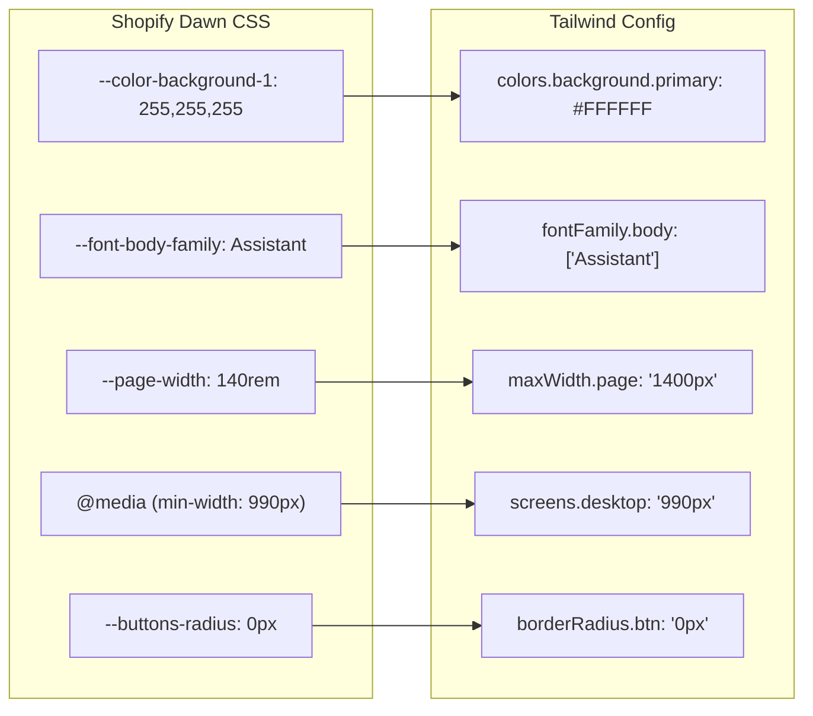
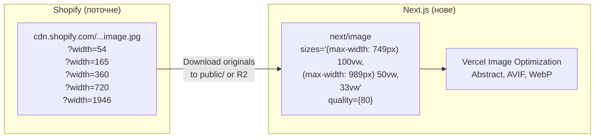

# 05. Міграція дизайн-системи

## 5.1 Дизайн-токени → Tailwind CSS конфігурація

### Маппінг Shopify CSS → Tailwind



### tailwind.config.ts

```typescript
import type { Config } from 'tailwindcss';

const config: Config = {
  content: ['./src/**/*.{ts,tsx}'],
  theme: {
    screens: {
      'mobile': '480px',
      'tablet': '750px',
      'desktop': '990px',
      'wide': '1200px',
    },
    fontFamily: {
      body: ['Assistant', 'sans-serif'],
      heading: ['Montserrat', 'sans-serif'],
    },
    extend: {
      colors: {
        brand: {
          red: {
            DEFAULT: '#7D0015',    // rgb(125, 0, 21) - Primary brand
            light: '#BA1934',      // rgb(186, 25, 52) - Crimson accent
          },
          tan: {
            DEFAULT: '#D4B59D',    // rgb(212, 181, 157)
            light: '#ECD6C6',      // rgb(236, 214, 198) - Peach
          },
          black: '#000000',
          dark: '#121212',         // rgb(18, 18, 18)
          gray: {
            light: '#F3F3F3',      // rgb(243, 243, 243)
            blue: '#242833',       // rgb(36, 40, 51)
          },
        },
      },
      maxWidth: {
        page: '1400px',
      },
      spacing: {
        'grid-desktop': '8px',
        'grid-mobile': '4px',
      },
      borderRadius: {
        'btn': '0px',
        'pill': '40px',
        'badge': '4rem',
      },
    },
  },
};

export default config;
```

## 5.2 Кольорові схеми (Theme Schemes)

Shopify Dawn використовує 10 кольорових схем. Для Next.js реалізуємо через CSS custom properties + Tailwind:

```css
/* globals.css */
@tailwind base;
@tailwind components;
@tailwind utilities;

@layer base {
  :root {
    /* Scheme: Default (white bg) */
    --scheme-bg: 255 255 255;
    --scheme-fg: 18 18 18;
    --scheme-btn: 18 18 18;
    --scheme-btn-text: 255 255 255;
  }

  /* Header scheme (black + tan) */
  .scheme-header {
    --scheme-bg: 0 0 0;
    --scheme-fg: 212 181 157;
    --scheme-btn: 186 25 52;
    --scheme-btn-text: 255 255 255;
  }

  /* Footer scheme (black + tan) */
  .scheme-footer {
    --scheme-bg: 0 0 0;
    --scheme-fg: 212 181 157;
    --scheme-btn: 186 25 52;
    --scheme-btn-text: 255 255 255;
  }

  /* Announcement bar (deep red + tan) */
  .scheme-announcement {
    --scheme-bg: 125 0 21;
    --scheme-fg: 212 181 157;
    --scheme-btn: 212 181 157;
    --scheme-btn-text: 125 0 21;
  }

  /* Alternate (light gray) */
  .scheme-alt {
    --scheme-bg: 243 243 243;
    --scheme-fg: 18 18 18;
    --scheme-btn: 18 18 18;
    --scheme-btn-text: 243 243 243;
  }

  /* Inverted (dark blue-gray) */
  .scheme-inverted {
    --scheme-bg: 36 40 51;
    --scheme-fg: 255 255 255;
    --scheme-btn: 255 255 255;
    --scheme-btn-text: 0 0 0;
  }

  /* Accent (near-black) */
  .scheme-accent {
    --scheme-bg: 18 18 18;
    --scheme-fg: 255 255 255;
    --scheme-btn: 255 255 255;
    --scheme-btn-text: 18 18 18;
  }
}
```

## 5.3 Маппінг компонентів Shopify → React

```mermaid
graph TD
    subgraph Shopify["Shopify Web Components"]
        S1["&lt;sticky-header&gt;"]
        S2["&lt;header-drawer&gt;"]
        S3["&lt;slider-component&gt;"]
        S4["&lt;slideshow-component&gt;"]
        S5["&lt;variant-selects&gt;"]
        S6["&lt;product-form&gt;"]
        S7["&lt;media-gallery&gt;"]
        S8["&lt;cart-notification&gt;"]
        S9["&lt;predictive-search&gt;"]
        S10["&lt;localization-form&gt;"]
    end

    subgraph React["React Components"]
        R1["StickyHeader.tsx\nIntersectionObserver + useState"]
        R2["MobileMenu.tsx\nDialog/Sheet + Framer Motion"]
        R3["Slider.tsx\nembla-carousel-react"]
        R4["Slideshow.tsx\nembla-carousel + autoplay"]
        R5["VariantSelector.tsx\nRadioGroup + URL state"]
        R6["ProductForm.tsx\nReact Hook Form + Zustand cart"]
        R7["ProductGallery.tsx\nembla-carousel + next/image"]
        R8["CartDrawer.tsx\nZustand + Sheet component"]
        R9["SearchBar.tsx\nuseDeferredValue + fetch"]
        R10["LocaleSwitcher.tsx\nnext-intl + useRouter"]
    end

    S1 --> R1
    S2 --> R2
    S3 --> R3
    S4 --> R4
    S5 --> R5
    S6 --> R6
    S7 --> R7
    S8 --> R8
    S9 --> R9
    S10 --> R10
```



## 5.4 Layout Grid (збереження структури)

### Body Grid

```
Shopify Dawn:                    Next.js:
┌─────────────────┐              ┌─────────────────┐
│ Announcement Bar │  row 1      │ AnnouncementBar  │
├─────────────────┤              ├─────────────────┤
│ Header (sticky)  │  row 2      │ StickyHeader     │
├─────────────────┤              ├─────────────────┤
│                  │              │                  │
│  Main Content    │  row 3      │  {children}      │
│  (flex: 1)       │              │  (flex: 1)       │
│                  │              │                  │
├─────────────────┤              ├─────────────────┤
│ Footer           │  row 4      │ Footer           │
└─────────────────┘              └─────────────────┘
```

### RootLayout.tsx

```tsx
export default function RootLayout({ children }) {
  return (
    <div className="grid grid-rows-[auto_auto_1fr_auto] grid-cols-[100%] min-h-screen">
      <AnnouncementBar />
      <StickyHeader />
      <main id="MainContent">{children}</main>
      <Footer />
    </div>
  );
}
```

## 5.5 Responsive Design

### Breakpoint маппінг

```
Shopify:                         Tailwind:
max-width: 749px  → Mobile       default (mobile-first)
min-width: 750px  → Tablet       tablet:
min-width: 990px  → Desktop      desktop:
```

### Типові responsive патерни для збереження

```
Product Grid:
  Mobile:  1 column     → grid-cols-1
  Tablet:  2-3 columns  → tablet:grid-cols-2 desktop:grid-cols-3
  Desktop: 3-4 columns  → desktop:grid-cols-4

Product Page:
  Mobile:  stack         → flex-col
  Desktop: 2 columns    → desktop:flex-row desktop:gap-8

Footer:
  Mobile:  1 column     → grid-cols-1
  Tablet:  2 columns    → tablet:grid-cols-2
  Desktop: 4 columns    → desktop:grid-cols-4
```

## 5.6 Зображення — міграція

### Shopify CDN → Next.js Image Optimization



### Завдання по міграції зображень

1. Завантажити **70 оригінальних зображень** з Shopify CDN (максимальна якість)
2. Зберегти в Cloudflare R2 або public/
3. Налаштувати `next/image` з responsive sizes
4. Зберегти alt-текст для кожного зображення

## 5.7 Шрифти — міграція

```typescript
// src/app/[locale]/layout.tsx
import { Assistant, Montserrat } from 'next/font/google';

const assistant = Assistant({
  subsets: ['latin', 'latin-ext', 'cyrillic'],
  weight: ['400', '700'],
  variable: '--font-body',
  display: 'swap',
});

const montserrat = Montserrat({
  subsets: ['latin', 'latin-ext', 'cyrillic'],
  weight: ['600'],
  variable: '--font-heading',
  display: 'swap',
});

export default function LocaleLayout({ children }) {
  return (
    <html className={`${assistant.variable} ${montserrat.variable}`}>
      <body className="font-body">{children}</body>
    </html>
  );
}
```

## 5.8 Анімації (збереження)

Shopify Dawn використовує scroll-triggered animations через IntersectionObserver. Еквівалент в React:

| Shopify | Next.js Equivalent |
|---------|-------------------|
| `scroll-trigger` class + IntersectionObserver | `framer-motion` `useInView` або CSS `@starting-style` |
| Zoom-in based on `percentageSeen()` | `framer-motion` scroll-linked animations |
| Slideshow autoplay | `embla-carousel` autoplay plugin |
| Menu drawer slide-in | `framer-motion` AnimatePresence |
| Cart notification slide-down | `sonner` toast або `framer-motion` |
