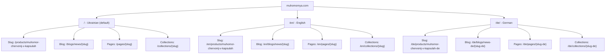
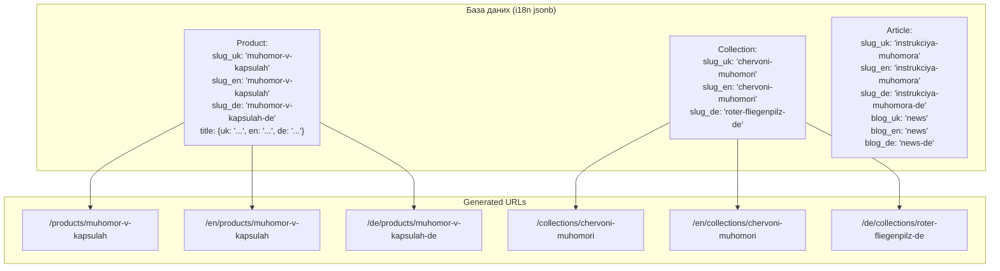

# 06. Стратегія інтернаціоналізації (i18n)

## 6.1 Поточна реалізація (Shopify)



### Ключові особливості поточної i18n

1. **Prefix-based routing**: UK на `/`, EN на `/en/`, DE на `/de/`
2. **Product slugs**: UK та EN — однакові slug; DE — часто суфікс `-de`
3. **Collection slugs**: UK та EN — однакові; DE — повністю перекладені (німецькі slug)
4. **Blog handles**: UK та EN — `news`; DE — `news-de`
5. **Page handles**: UK та EN — `about`, `faq`; DE — `about-de`, `faq-de`
6. **Валюта**: UAH скрізь, незалежно від мови
7. **Повна статична генерація**: кожна сторінка — окремий HTML файл

## 6.2 Нова реалізація (next-intl)

### Конфігурація

```typescript
// src/i18n/config.ts
export const locales = ['uk', 'en', 'de'] as const;
export type Locale = (typeof locales)[number];
export const defaultLocale: Locale = 'uk';

// Routing: UK без prefix, EN та DE з prefix
export const localePrefix = 'as-needed'; // UK = /, EN = /en, DE = /de
```

### Middleware (routing + geo-redirect)

```typescript
// middleware.ts
import createMiddleware from 'next-intl/middleware';
import { locales, defaultLocale } from './i18n/config';

export default createMiddleware({
  locales,
  defaultLocale,
  localePrefix: 'as-needed',
  localeDetection: true, // Accept-Language header
});

export const config = {
  matcher: ['/((?!api|_next|.*\\..*).*)'],
};
```

### Структура перекладів

```
src/i18n/messages/
├── uk.json     # Українська (UI strings)
├── en.json     # English
└── de.json     # Deutsch
```

**Важливо**: UI-строки (кнопки, заголовки, навігація) — у JSON файлах. Контент (товари, статті, сторінки) — у базі даних з `jsonb` полями.

### Приклад JSON для UI

```json
// uk.json
{
  "nav": {
    "home": "Головна",
    "catalog": "Каталог",
    "wholesale": "Оптовикам",
    "blog": "Блог",
    "instructions": "Інструкції по вживанню",
    "useful_info": "Корисна інформація",
    "faq": "FAQ",
    "contacts": "Контакти"
  },
  "product": {
    "add_to_cart": "Додати в кошик",
    "buy_now": "Купити зараз",
    "in_stock": "В наявності",
    "out_of_stock": "Немає в наявності",
    "composition": "Склад",
    "storage": "Умови зберігання",
    "shelf_life": "Термін придатності",
    "contraindications": "Протипоказання",
    "disclaimer": "ХАРЧОВА ДОБАВКА НЕ Є ЛІКАРСЬКИМ ЗАСОБОМ!"
  },
  "cart": {
    "title": "Кошик",
    "empty": "Ваш кошик порожній",
    "checkout": "Оформити замовлення",
    "continue_shopping": "Продовжити покупки",
    "subtotal": "Підсумок"
  },
  "checkout": {
    "contact_info": "Контактні дані",
    "shipping": "Доставка",
    "payment": "Оплата",
    "email": "Електронна пошта",
    "phone": "Телефон",
    "first_name": "Ім'я",
    "last_name": "Прізвище",
    "city": "Місто",
    "warehouse": "Відділення Нової Пошти",
    "place_order": "Оформити замовлення",
    "pay_with_apple_pay": "Оплатити через Apple Pay",
    "pay_with_google_pay": "Оплатити через Google Pay"
  },
  "footer": {
    "copyright": "Крамниця Мухоморня - Купити сушений мухомор в Україні."
  }
}
```

## 6.3 URL-маппінг за мовами



## 6.4 Hreflang генерація

```typescript
// src/components/seo/HreflangTags.tsx
export function generateHreflangAlternates(
  type: 'product' | 'collection' | 'article' | 'page',
  slugs: { uk: string; en: string; de: string },
  pathPrefix: string, // e.g., 'products', 'collections'
) {
  const base = 'https://muhomornya.com';

  return {
    'x-default': `${base}/${pathPrefix}/${slugs.uk}`,
    'uk': `${base}/${pathPrefix}/${slugs.uk}`,
    'en': `${base}/en/${pathPrefix}/${slugs.en}`,
    'de': `${base}/de/${pathPrefix}/${slugs.de}`,
  };
}
```

## 6.5 Країни доставки (31 країна)

Локалізація форми вибору країни збережена:

| Код | UA назва | EN назва | DE назва |
|-----|----------|----------|----------|
| UA | Україна | Ukraine | Ukraine |
| DE | Німеччина | Germany | Deutschland |
| US | Сполучені Штати | United States | Vereinigte Staaten |
| CA | Канада | Canada | Kanada |
| GB | Великобританія | United Kingdom | Vereinigtes Königreich |
| PL | Польща | Poland | Polen |
| ... | (31 країна) | | |

## 6.6 SEO per locale

Кожна мова повинна мати унікальні:

| Елемент | UK приклад | EN приклад | DE приклад |
|---------|-----------|-----------|-----------|
| `<title>` | Купити червоний мухомор... | Buy red amanita... | Roter Fliegenpilz kaufen... |
| `meta description` | Купити сушений мухомор... | Buy Amanita Muscaria... | Getrocknete Fliegenpilze... |
| `og:title` | Купити червоний мухомор | Buy red amanita | Roter Fliegenpilz kaufen |
| `og:image` | logotype (uk) | logotype-eng | logotype-eng |
| `og:locale` | uk_UA | en_US | de_DE |
| JSON-LD name | Крамниця Мухоморня | Крамниця Мухоморня | Крамниця Мухоморня |
