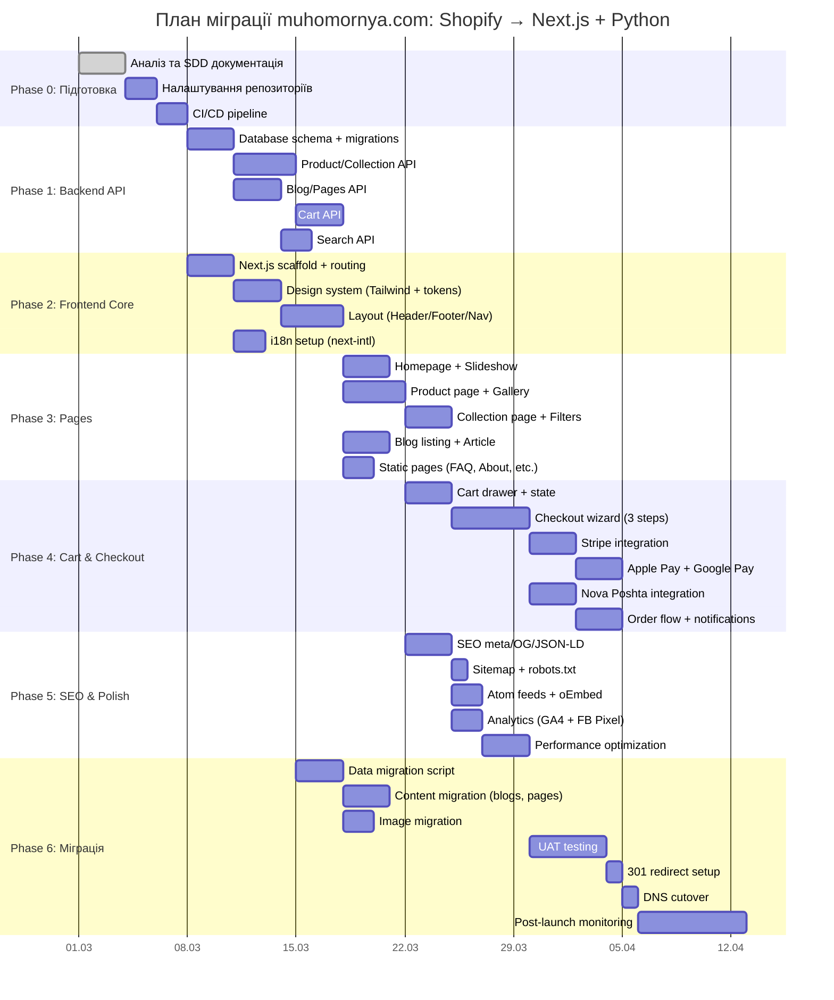
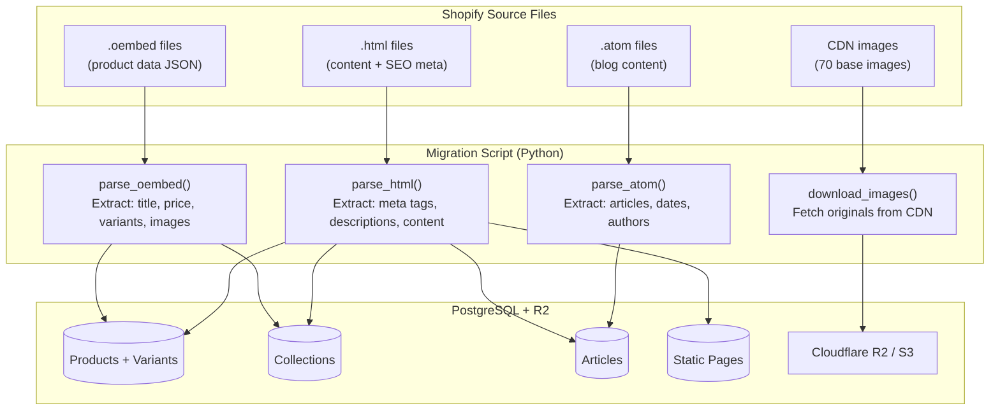
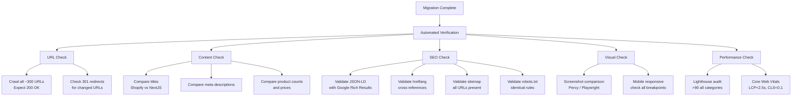
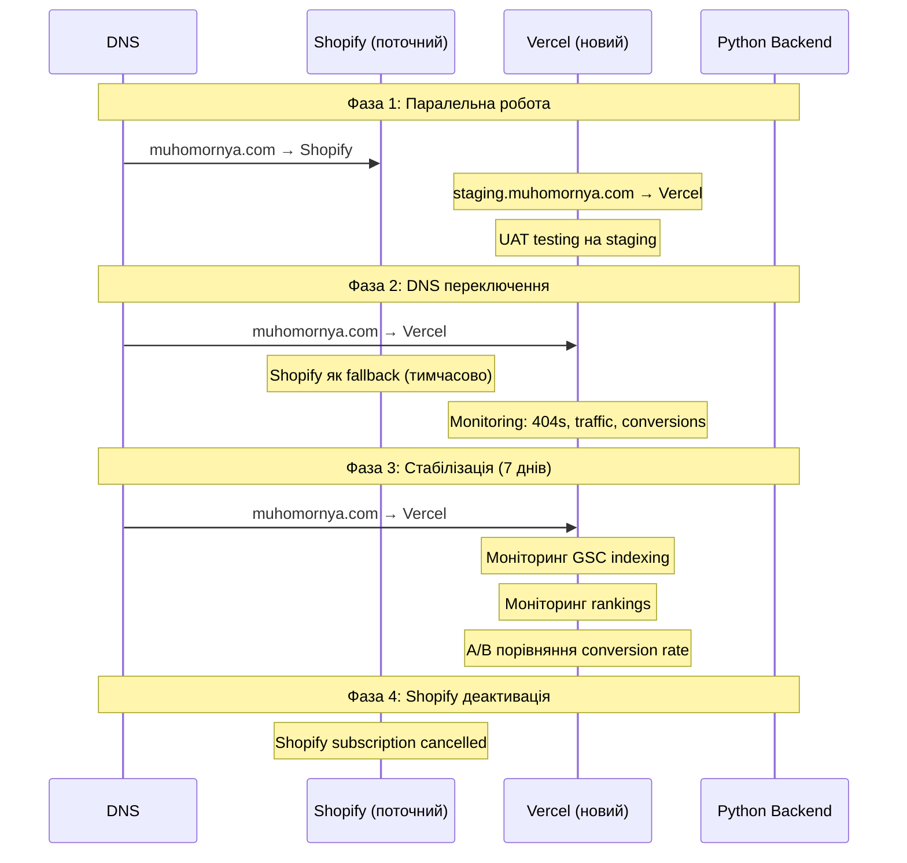
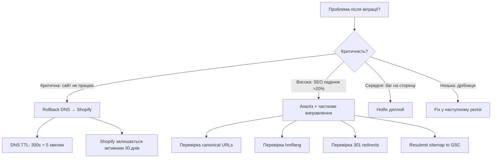

# 07. План міграції даних та поетапний розгортання

## 7.1 Загальний план міграції



## 7.2 Міграція даних (Shopify → PostgreSQL)



### Migration Script (Python)

```python
# scripts/migrate_data.py

import json
import re
from pathlib import Path
from bs4 import BeautifulSoup

SOURCE_DIR = Path("muhomornya.source")
LOCALES = ["uk", "en", "de"]

def parse_product_oembed(file_path: Path) -> dict:
    """Parse .oembed JSON file to extract product data."""
    data = json.loads(file_path.read_text())
    return {
        "slug": data["product_id"],
        "title": data["title"],
        "description_html": data["description"],
        "brand": data["brand"],
        "thumbnail_url": data["thumbnail_url"],
        "canonical_url": data["url"],
        "variants": [
            {
                "title": offer["title"],
                "shopify_variant_id": offer["offer_id"],
                "sku": offer["sku"],
                "price": offer["price"],
                "currency": offer["currency_code"],
                "in_stock": offer["in_stock"],
            }
            for offer in data.get("offers", [])
        ],
    }

def parse_html_meta(file_path: Path) -> dict:
    """Extract SEO meta from HTML file."""
    soup = BeautifulSoup(file_path.read_text(), "html.parser")
    return {
        "title": soup.title.string if soup.title else "",
        "meta_description": _get_meta(soup, "description"),
        "og_title": _get_og(soup, "og:title"),
        "og_description": _get_og(soup, "og:description"),
        "og_image": _get_og(soup, "og:image"),
        "canonical": _get_link(soup, "canonical"),
        "hreflang": _get_hreflangs(soup),
    }

def migrate_all():
    """Main migration pipeline."""
    # 1. Products (3 locales)
    products = {}
    for locale in LOCALES:
        oembed_dir = get_products_dir(locale)
        for f in oembed_dir.glob("*.oembed"):
            product_data = parse_product_oembed(f)
            slug = product_data["slug"]
            if slug not in products:
                products[slug] = {"variants": product_data["variants"]}
            products[slug][f"title_{locale}"] = product_data["title"]
            products[slug][f"description_{locale}"] = product_data["description_html"]

    # 2. Blog articles from .atom feeds
    # 3. Static pages from .html
    # 4. Collections from collection .oembed
    # 5. Download images

    # Insert into PostgreSQL via SQLAlchemy
    ...
```

## 7.3 Верифікація міграції



## 7.4 Стратегія розгортання (Zero-downtime)



## 7.5 Rollback план



## 7.6 Моніторинг після запуску

| Метрика | Інструмент | Порог алерту | Частота |
|---------|-----------|-------------|---------|
| **Uptime** | Vercel / UptimeRobot | <99.9% | Real-time |
| **Error rate (5xx)** | Vercel Analytics | >1% | Real-time |
| **404 errors** | Google Search Console | >10 нових | Щоденно |
| **Indexing coverage** | GSC | Зменшення >5% | Щоденно |
| **Search rankings** | Ahrefs / Semrush | Падіння >10 позицій | Щотижня |
| **Organic traffic** | GA4 | Падіння >15% | Щотижня |
| **Conversion rate** | GA4 | Падіння >10% | Щотижня |
| **Core Web Vitals** | GSC / PageSpeed | Red zone | Щотижня |
| **LCP** | Vercel Speed Insights | >2.5s | Real-time |
| **Payment success rate** | Stripe Dashboard | <95% | Щоденно |
