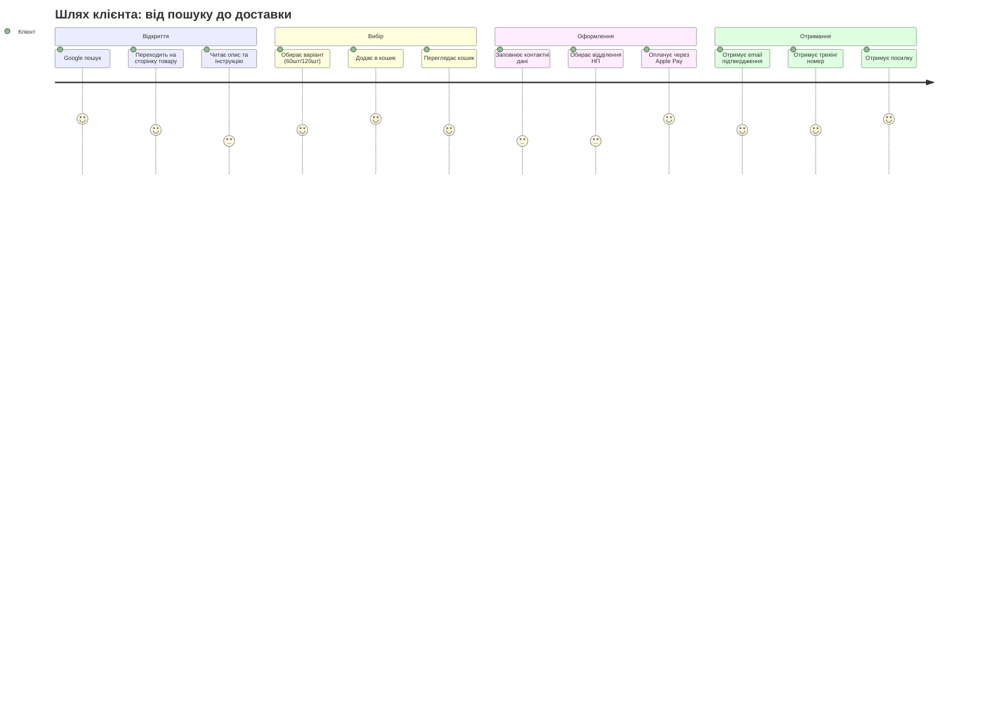
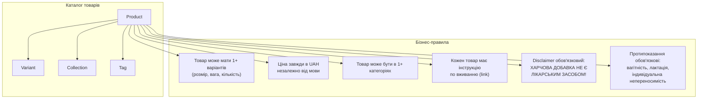
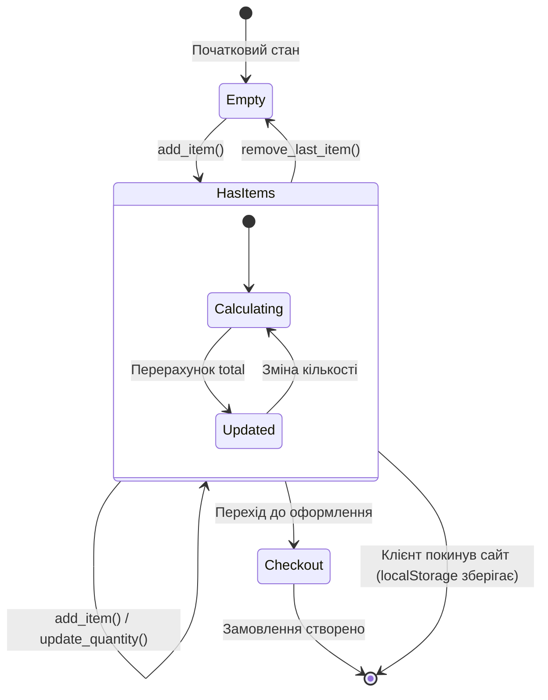
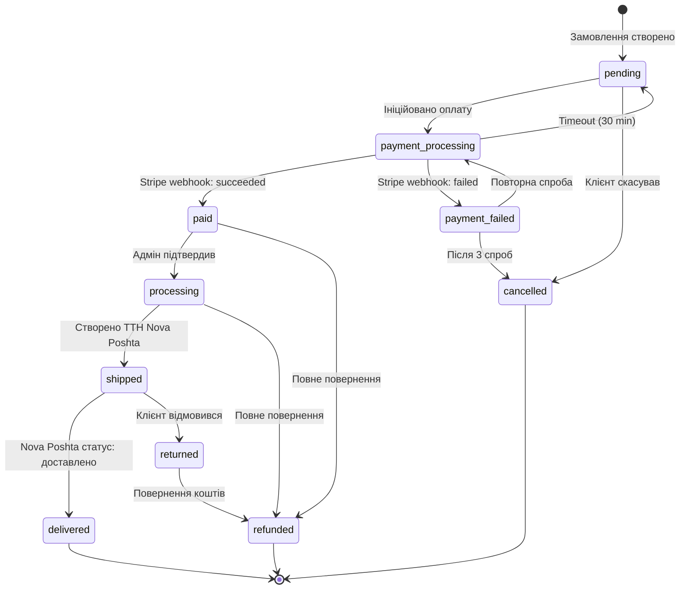
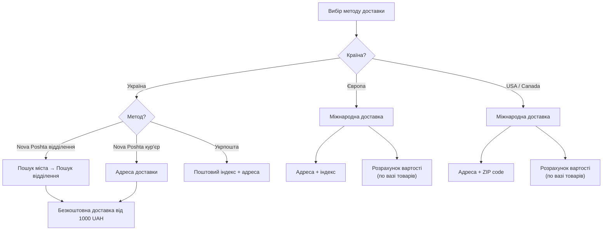
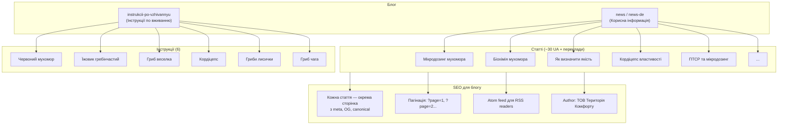
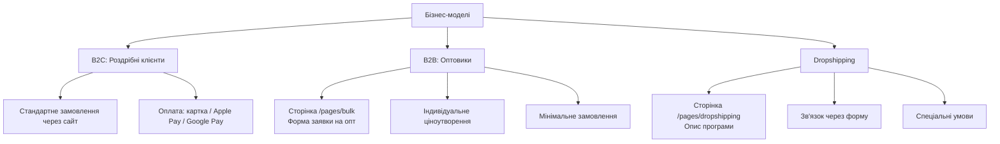
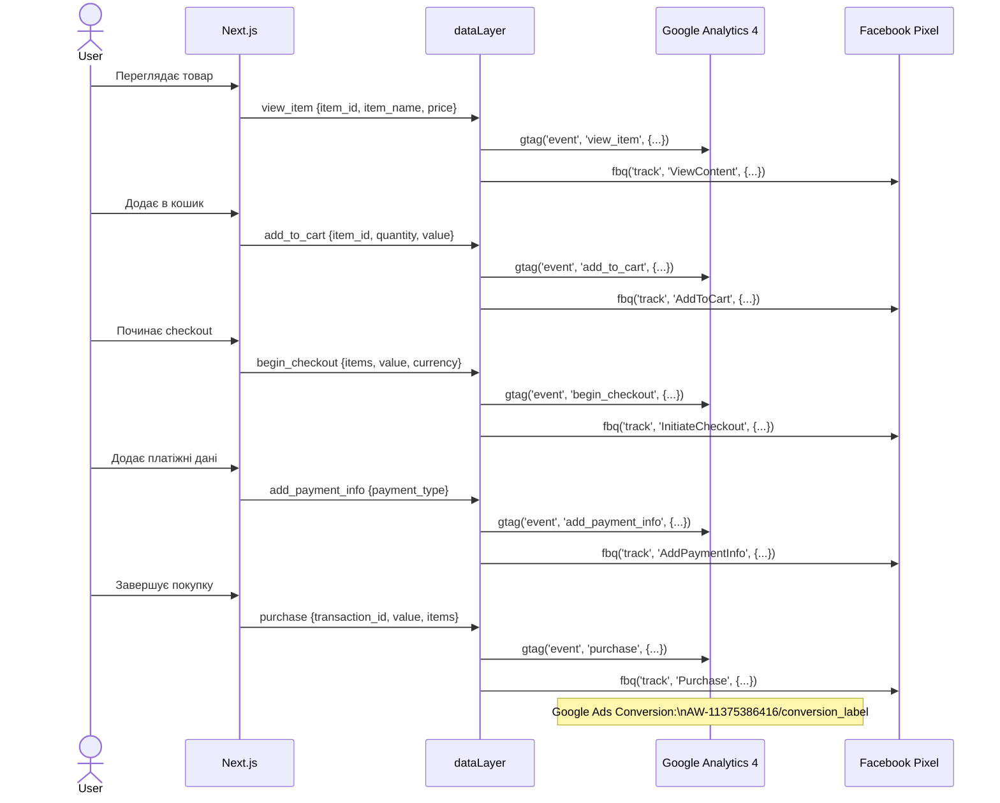

# 08. Бізнес-логіка та процеси

## 8.1 User Journey — Покупка товару

## 8.2 Продуктовий каталог — бізнес-правила

## 8.3 Cart — Бізнес-логіка

### Cart бізнес-правила

| Правило | Опис |
|---------|------|
| **Збереження** | Кошик зберігається в localStorage (TTL: 7 днів) |
| **Варіанти** | При додаванні того ж товару з іншим варіантом — окремий рядок |
| **Кількість** | Min: 1, Max: залежить від stock_quantity |
| **Ціна** | Завжди UAH, фіксована на момент додавання |
| **Оновлення ціни** | При відкритті кошика — перевірка актуальності ціни через API |
| **Out of stock** | Показувати warning якщо товар зник з наявності |

## 8.4 Order — Стани та переходи

### Тригери переходів

| Перехід | Тригер | Дія |
|---------|--------|-----|
| `pending → payment_processing` | User починає оплату | Create PaymentIntent |
| `payment_processing → paid` | Stripe webhook `payment_intent.succeeded` | Save payment, send confirmation email |
| `paid → processing` | Адмін натиснув "Підтвердити" | Telegram notification |
| `processing → shipped` | Адмін вводить ТТН | Email з трекінг-номером |
| `shipped → delivered` | Nova Poshta API callback | Email "Замовлення доставлено" |
| `any → cancelled` | Адмін або клієнт скасовує | Stripe refund (якщо оплачено) |

## 8.5 Shipping — Логіка доставки

### Shipping бізнес-правила

| Правило | Опис |
|---------|------|
| **Безкоштовна доставка** | Від 1000 UAH (Україна, Nova Poshta) |
| **Вага варіанту** | Зберігається в `weight_grams` у Variant |
| **Трекінг** | Автоматичне створення ТТН через NP API |
| **Міжнародна** | Вартість розраховується по зонах + вага |
| **Обмеження** | Деякі товари можуть мати обмеження на міжнародну доставку |

## 8.6 Blog — Контентна модель

## 8.7 Dropshipping & Wholesale (Bulk)

## 8.8 Analytics Events — Data Layer

### Event mapping (Shopify → Next.js)

| Shopify Event | GA4 Event | FB Pixel | Сторінка |
|--------------|-----------|----------|----------|
| Page view | `page_view` | `PageView` | Всі |
| Product view | `view_item` | `ViewContent` | Product |
| Add to cart | `add_to_cart` | `AddToCart` | Product/Collection |
| Begin checkout | `begin_checkout` | `InitiateCheckout` | Checkout |
| Add payment | `add_payment_info` | `AddPaymentInfo` | Checkout step 3 |
| Purchase | `purchase` | `Purchase` | Success page |
| Search | `search` | `Search` | Search |
